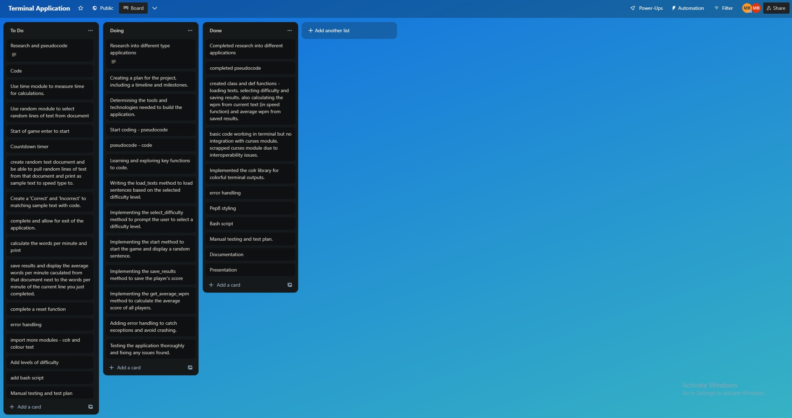
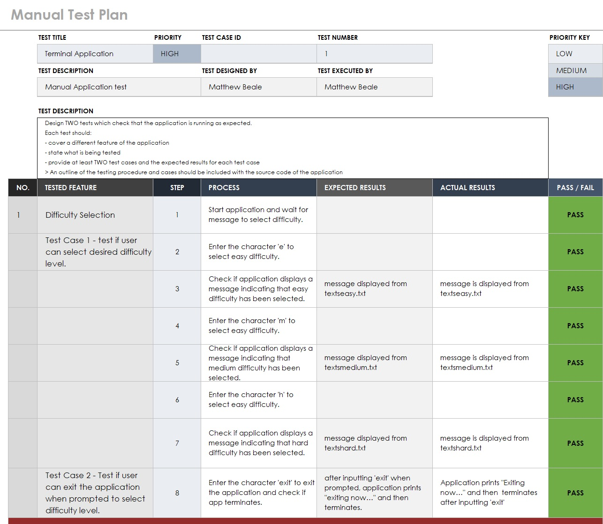
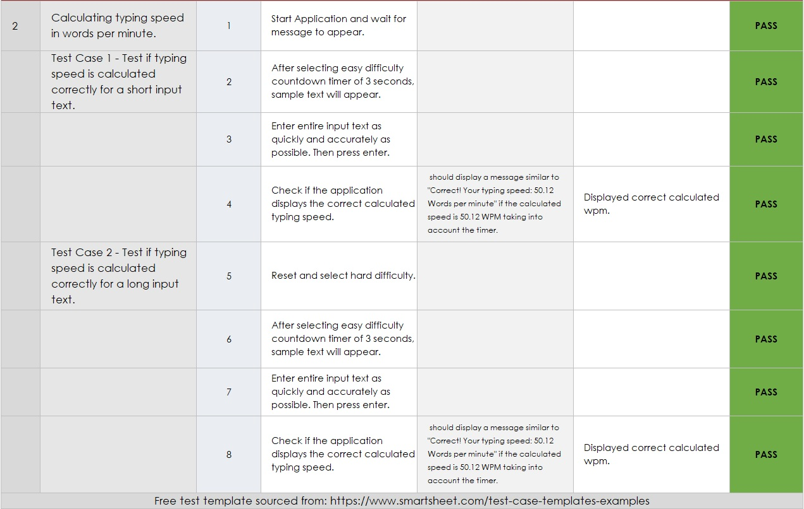

# MatthewBeale_T1A3

## [Video presentation link](https://youtu.be/ITBKicN6GPI)
## [Link to HELP.md](./docs/HELP.md)
## [Trello board for planning link](https://trello.com/invite/b/b3asaOTU/ATTIc532aec15c1c801228a3fbe6a4613b3aE42B3925/terminal-application)
## [Github Repo](https://github.com/mttble/MatthewBeale_T1A3)
## Manual Test Plan located in: ./docs/MatthewBeale_T1A3testplan.xlsx
## Powerpoint presentation located in: ./ppt/MatthewBeale_T1A3.pptx

## R1: 
## Answer all documentation requirements below.

## R2: 
##  Your README.md should have a separate heading for each documentation requirement and answers organised under the appropriate headings.

## R3:
##   Provide full attribution to referenced sources (where applicable).
Test plan templated sourced from: https://www.smartsheet.com/test-case-templates-examples

Research for Terminal application and referenced source/attribution: https://www.youtube.com/watch?v=quBb--IJPPc&t=384s

## R4:
## Provide a link to your source control repository
https://github.com/mttble/MatthewBeale_T1A3

## R5:
##  Identify any code style guide or styling conventions that the application will adhere to. Reference the chosen style guide appropriately.

PEP 8 – Style Guide for Python Code

https://peps.python.org/pep-0008/

## R6:
##  Develop a list of features that will be included in the application. It must include:
- ###  at least THREE features
- ###  describe each feature

##  Note: Ensure that your features above allow you to demonstrate your understanding of the following language elements and concepts:
- ###  use of variables and the concept of variable scope
- ###  loops and conditional control structures
- ###  error handling

The features in my terminal application that i have been working on are:
- Difficulty Selection of easy, medium and hard.
- Randomly select line of text from text document depending on difficulty selected.
- Calculation of words per minute based on a timer.
- Save results in text document 
- Calculate the average based on previous recorded results saved in text file.

## R7:
 Develop an implementation plan which:
-  outlines how each feature will be implemented and a checklist of tasks for each feature
- prioritise the implementation of different features, or checklist items within a feature
- provide a deadline, duration or other time indicator for each feature or checklist/checklist-item

 Utilise a suitable project management platform to track this implementation plan.

 Provide screenshots/images and/or a reference to an accessible project management platform used to track this implementation plan. 

>  Your checklists for each feature should have at least 5 items.

Trello Board link: https://trello.com/invite/b/b3asaOTU/ATTIc532aec15c1c801228a3fbe6a4613b3aE42B3925/terminal-application

## R8:
 Design help documentation which includes a set of instructions which accurately describe how to use and install the application.

 You must include:
-  steps to install the application
-  any dependencies required by the application to operate
-  any system/hardware requirements
-  how to use any command line arguments made for the application

Help documentation located in HELP.md in docs directory.
## [Link to HELP.md](./docs/HELP.md)

# Slide deck

## R9:  An overview of your Terminal application.
###  The main features and overall structure of your app

## R10: An overview of your code.
### 	 An explanation of the important parts of your code, including any crucial application logic

## Powerpoint presentation located in: ./ppt/MatthewBeale_T1A3.pptx

# Code Requirements

## R11:
 Implement features in the software development plan you have designed. You must utilise a range of programming concepts and structures using Python such as:
- variables and variable scope
- loops and conditional control structures
- write and utilise simple functions
- error handling
- input and output
- importing a Python package
- using functions from a Python package

## R12:
 Apply DRY (Don’t Repeat Yourself) coding principles to all code produced.

## R13:
Apply all style and conventions for the programming language consistently to all code produced.

## R14:
 Creates an application which runs without error and has features that are consistent with the development plan.

## R15:
Design TWO tests which check that the application is running as expected.

Each test should:
- cover a different feature of the application
- state what is being tested
- provide at least TWO test cases and the expected results for each test case

> An outline of the testing procedure and cases should be included with the source code of the application

## Manual Test Plan located in: ./docs/MatthewBeale_T1A3testplan.xlsx

## R16:
Utilise source control throughout the development of the application by:
- making regular commits (at least 20 commits) with a commit message that summarises the changes
- pushing all commits to a remote repository

## [Github Repo](https://github.com/mttble/MatthewBeale_T1A3)

## R17:
Utilise developer tools to facilitate the execution of the application:
For example,
- writing a script which turns the application into an executable
## [Bash Script](./src/typethis.sh)